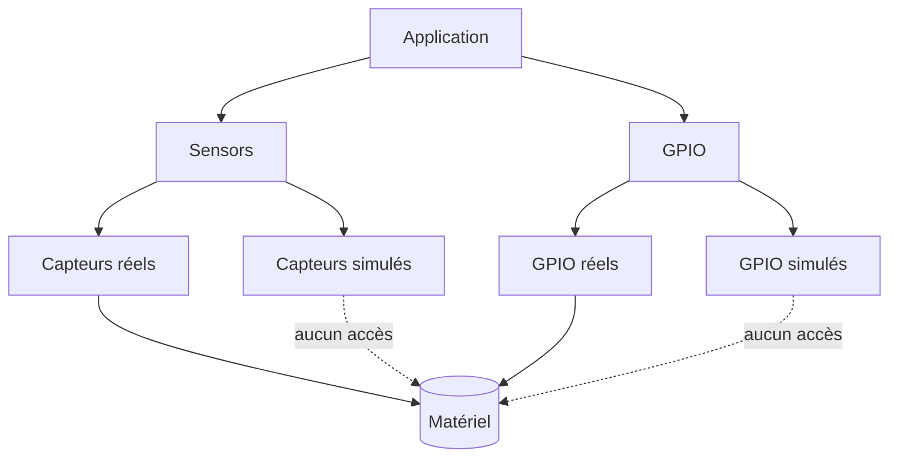

# Reptile Game on ESP32-S3 with 1024×600 LCD

| Supported Targets | ESP32-S3 |
|-------------------|----------|
| LCD Controller    | ST7262   |
| Touch Controller  | GT911    |

## Objectifs du projet
Ce dépôt illustre le développement d'un jeu reptile temps réel exécuté sur un ESP32‑S3 associé à un écran TFT 1024×600.
Le moteur graphique s'appuie sur LVGL et un pilote RGB ST7262, tandis qu'un contrôleur tactile capacitif GT911 gère l'interaction utilisateur.

## Prérequis
### Logiciel
- **ESP-IDF 5.5** installé et initialisé (`. ./export.sh`).
- **LVGL 8.3.9** via le gestionnaire de composants (`idf_component.yml`).

### Matériel
- Carte de développement ESP32‑S3.
- Écran TFT 1024×600 piloté par **ST7262**.
- Contrôleur tactile capacitif **GT911**.

## Construction et flash
```sh
idf.py build flash monitor
```
Cette commande récupère automatiquement les dépendances déclarées dans `idf_component.yml`,
compile le projet, programme le microcontrôleur puis ouvre le moniteur série.

## Options de configuration
- `CONFIG_REPTILE_DEBUG` : désactive la mise en veille automatique au démarrage afin
  de faciliter le débogage. La veille peut ensuite être réactivée ou désactivée à
  l'exécution via le bouton **Veille ON/OFF** de l'interface.

## Menu de démarrage et modes d'exécution
Au reset, le firmware affiche un menu minimaliste permettant de choisir entre deux modes :

- **Simulation** : emploi des pilotes `sensors_sim` et `gpio_sim`. Ces implémentations génèrent
  des valeurs factices ou celles injectées par l'API de simulation et *n'accèdent jamais au
  matériel*.
- **Réel** : activation des pilotes `sensors_real` et `gpio_real` qui dialoguent directement avec
  les capteurs I²C et les broches GPIO.

La sélection est persistée pour la session suivante afin de relancer automatiquement le mode
précédent.

### Schéma de dépendances


### Chemins de sauvegarde et tests `sim_api`
Le module de logique reptile enregistre son état sur la carte SD dans des emplacements distincts :

- **Simulation** : `/sd/sim/reptile_state.bin`
- **Réel** : `/sd/real/reptile_state.bin`

Pour valider les pilotes simulés depuis un PC, l'en-tête `sim_api.h` expose des points d'injection
(`sensors_sim_set_temperature`, `sensors_sim_set_humidity`) et d'observation
(`gpio_sim_get_heater_state`, `gpio_sim_get_pump_state`). Un test de bout en bout peut être exécuté
en mode simulation :

```sh
gcc -DGAME_MODE_SIMULATION \
    tests/sim_reptile.c \
    components/sensors/sensors.c components/sensors/sensors_sim.c \
    components/gpio/gpio.c components/gpio/gpio_sim.c \
    -Icomponents/sim_api -Icomponents/sensors -Icomponents/gpio \
    -o sim_reptile && ./sim_reptile
```


## Structure des dossiers
```
.
├── components/     # Modules réutilisables (port LVGL, tactile, logique reptile, etc.)
├── main/           # Point d'entrée applicatif et logique du jeu
├── CMakeLists.txt
├── Makefile
└── ...
```

## Exemple d'exécution
Après flash, le moniteur série affiche :
```
I (0) boot: ESP-IDF v5.5
I (123) reptile_game: Initializing LVGL...
I (456) reptile_game: Game started, touch to feed the reptile!
```
L'écran LCD présente alors l'interface du jeu reptile avec interaction tactile.

## Trame CAN
Le firmware publie toutes les secondes l'état du reptile sur le bus CAN à **125 kbps**.

- **Identifiant** : `0x100` (standard, 11 bits)
- **DLC** : 8 octets
- **Payload (little‑endian)** :

| Octets | Champ         | Type    |
|-------:|---------------|---------|
| 0‑1    | faim          | `uint16`|
| 2‑3    | eau           | `uint16`|
| 4‑5    | température   | `uint16`|
| 6‑7    | humeur        | `uint16`|

Chaque valeur est codée sur 16 bits, poids faible en premier.
